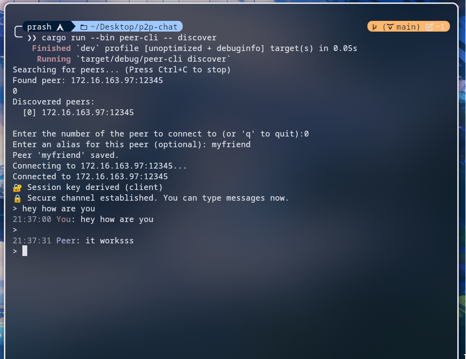
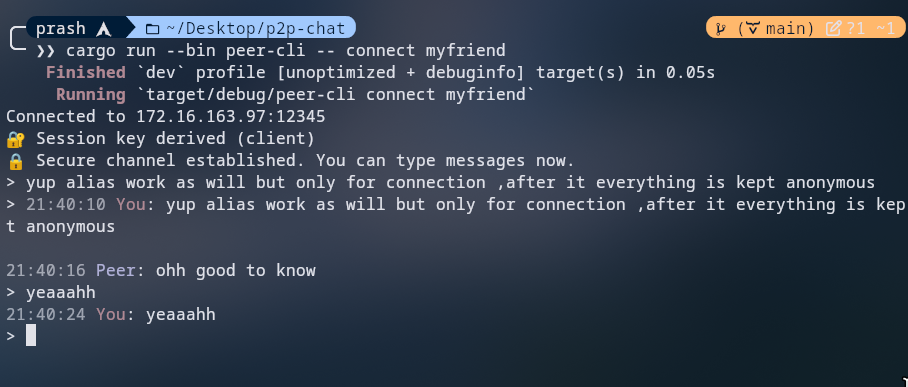

# P2P Encrypted Chat

Welcome to P2P Encrypted Chat, a secure and private command-line chat application. This application allows you to connect directly with another user on the same network without relying on a central server. All your conversations are end-to-end encrypted, ensuring that only you and the person you're talking to can read them.

## Features

- **End-to-End Encryption**: Using XChaCha20-Poly1305, your messages are secure from eavesdroppers.
- **Serverless**: Communicate directly with your peers, no central server involved.
- **Peer Discovery**: Automatically find other users on your local network.
- **Interactive Discovery**: Choose who to connect to from a list of discovered peers.
- **Peer Aliases**: Save your friends' addresses with easy-to-remember aliases.
- **Colored Chat UI**: A simple and intuitive interface with colored messages and timestamps.

## Screenshots

_Discovering a peer on the network:_


_Connecting to a peer by alias:_


## How It Works

This application uses a peer-to-peer (P2P) model. Here's a simple breakdown of how it works:

1.  **Listening**: One user starts the application in "listen" mode. This opens a port on their computer and starts broadcasting their presence on the network.
2.  **Discovering**: Another user can then use the "discover" command to find peers who are broadcasting their presence.
3.  **Connecting**: When a user is discovered, the second user can connect to them directly.
4.  **Secure Session**: Once connected, the two applications perform a cryptographic handshake to establish a secure, encrypted session.
5.  **Chatting**: With the secure session established, you can now chat freely and securely.

## Getting Started

### Prerequisites

- [Rust](https://www.rust-lang.org/tools/install) installed on your system.

### Building and Running

1.  **Clone the repository:**

    ```bash
    git clone https://github.com/prashilthul/rust-P2P-chat-cli
    cd p2p-chat
    ```

2.  **Build the project:**

    ```bash
    cargo build
    ```

3.  **Run the application:**
    All commands are run through the `peer-cli` binary. The basic syntax is:
    ```bash
    cargo run --bin peer-cli -- <COMMAND>
    ```

## Commands

Here are the available commands and how to use them:

### `listen`

Starts the application in listening mode, allowing other users to connect to you.

**Usage:**

```bash
cargo run --bin peer-cli -- listen <IP_ADDRESS:PORT>
```

**Example:**
To listen on all available network interfaces on port 12345:

```bash
cargo run --bin peer-cli -- listen 0.0.0.0:12345
```

### `discover`

Searches for peers on your local network and provides an interactive way to connect to them.

**Usage:**

```bash
cargo run --bin peer-cli -- discover
```

When you run this command, it will show a list of discovered peers. You can then select a peer to connect to and optionally save them with an alias.

### `connect`

Connects to a peer using their alias or their direct IP address and port.

**Usage:**

```bash
cargo run --bin peer-cli -- connect <ALIAS|IP_ADDRESS:PORT>
```

**Examples:**

```bash
# Connect using an alias
cargo run --bin peer-cli -- connect my-friend

# Connect using a direct address
cargo run --bin peer-cli -- connect 192.168.1.10:12345
```

### `add-peer`

Saves a peer with an alias for easy connection in the future.

**Usage:**

```bash
cargo run --bin peer-cli -- add-peer <ALIAS> <IP_ADDRESS:PORT>
```

**Example:**

```bash
cargo run --bin peer-cli -- add-peer my-friend 192.168.1.10:12345
```

### `list-peers`

Lists all the peers you have saved with aliases.

**Usage:**

```bash
cargo run --bin peer-cli -- list-peers
```

## Example Workflow

Here's a step-by-step example of how two users, Alice and Bob, can start a chat session.

1.  **Alice starts listening:**
    Alice runs the `listen` command on her computer.

    ```bash
    # On Alice's computer
    cargo run --bin peer-cli -- listen 0.0.0.0:12345
    ```

2.  **Bob discovers Alice:**
    Bob runs the `discover` command on his computer. He sees Alice in the list of discovered peers.

    ```bash
    # On Bob's computer
    cargo run --bin peer-cli -- discover
    ```

    Bob selects Alice from the list and saves her with the alias "alice".

3.  **Bob connects to Alice:**
    Bob is now connected to Alice, and they can start chatting securely.

4.  **Future Connections:**
    The next time Bob wants to chat with Alice, he can simply use the `connect` command with her alias:
    ```bash
    # On Bob's computer
    cargo run --bin peer-cli -- connect alice
    ```

## Technology Stack

- **Rust**: A modern, fast, and memory-safe programming language.
- **Tokio**: An asynchronous runtime for writing reliable network applications.
- **x25519-dalek**: A pure-Rust implementation of X25519 elliptic curve Diffie-Hellman key exchange.
- **chacha20poly1305**: A pure-Rust implementation of the ChaCha20-Poly1305 AEAD.
- **serde**: A framework for serializing and deserializing Rust data structures.
- **colored**: A library for adding colors to terminal output.
